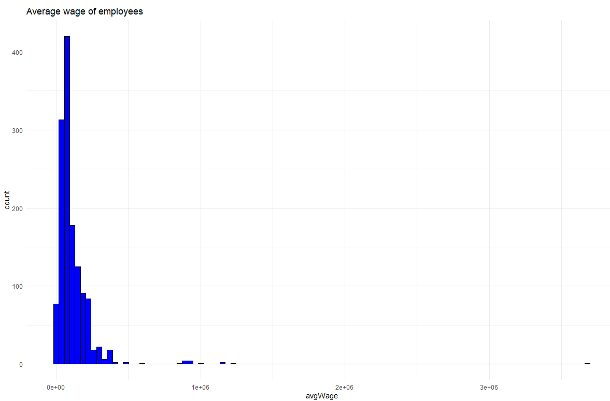
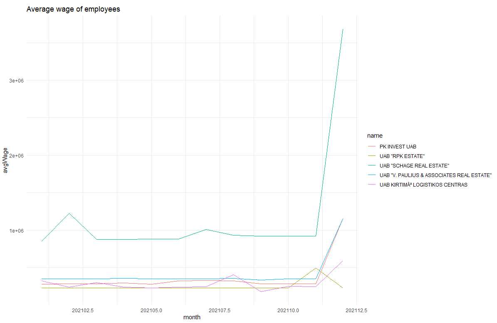
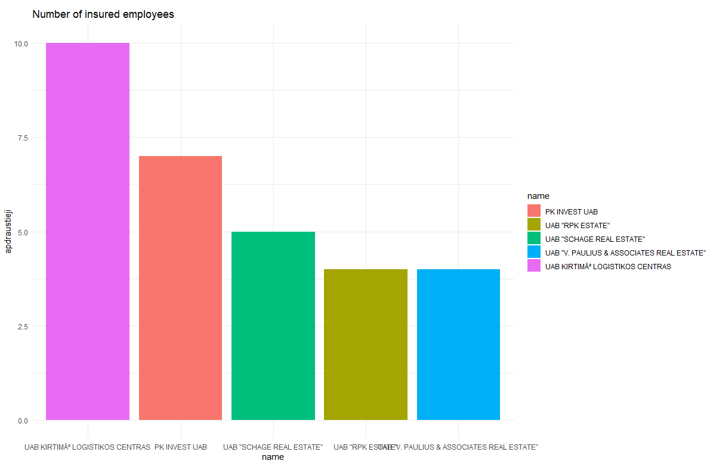

# R Laboratorinis darbas: duomenų vizualizacija

| Variantas | ecoActCode |
|------------- | ------------- |
|12   | 681000 |

### 1. Užduotis

Atsakymas:

Išvados:

### 2. Užduotis

Atsakymas:

Išvados:

### 3. Užduotis

Atsakymas:

Išvados:

### 4. Užduotis

Shiny R aplikacijos nuotrauka:

